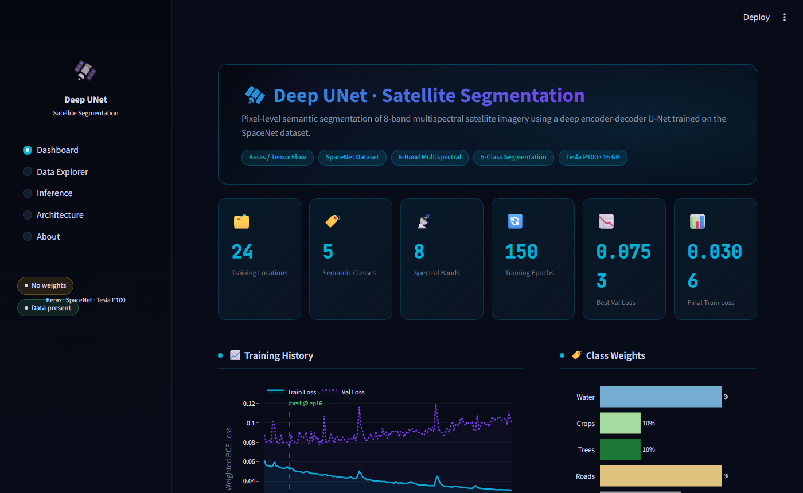
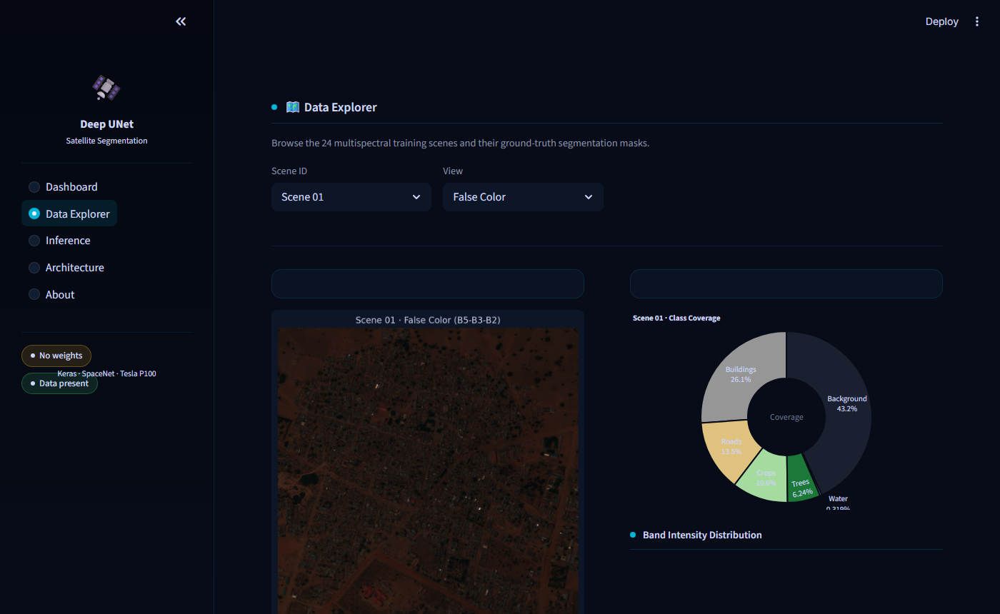

# 🛰️ Deep UNet for Satellite Image Segmentation


[](https://www.python.org/)
[](https://keras.io/)
[](https://www.nvidia.com/)
[](https://spacenet.ai/)
[](https://streamlit.io/)

---

## 📌 Overview

A **Keras-based Deep UNet implementation** for multi-class semantic segmentation of high-resolution satellite imagery. The model leverages spectral data from 8-band commercial satellite images to identify and classify land-use features with high accuracy.

---

## 📂 Dataset

The training data is sourced from the **[SpaceNet Dataset](https://spacenet.ai/)** and consists of commercial-grade 8-band multispectral satellite imagery.

| Property | Details |
|---|---|
| **Source** | SpaceNet (commercial-grade) |
| **Locations** | 24 geographic locations |
| **Image Type** | 8-channel multispectral TIFF |
| **Image Resolution** | 16-bit satellite images |
| **Mask Resolution** | 8-bit segmentation masks |
| **Classes** | Buildings, Roads, Trees, Crops, Water |

### 🌈 Spectral Bands

| Band | Name | Wavelength |
|---|---|---|
| 1 | Coastal | ~450 nm |
| 2 | Blue | ~480 nm |
| 3 | Green | ~560 nm |
| 4 | Yellow | ~590 nm |
| 5 | Red | ~625 nm |
| 6 | Red Edge | ~700 nm |
| 7 | Near-IR1 | ~780 nm |
| 8 | Near-IR2 | ~870 nm |

---

## ⚙️ Implementation Details

- **Architecture** — Deep UNet with encoder-decoder structure for precise pixel-level segmentation
- **Augmentation (Train)** — Input images are augmented to significantly expand the effective training dataset
- **Augmentation (Test)** — Test-time augmentation (TTA) is applied across 7 geometric variants; mean predictions are exported to `result.tif`
- **Hardware** — Trained on an **NVIDIA Tesla P100-PCIE-16GB** GPU

### Sample Input & Masks


---

## 🏗️ Network Architecture

The Deep UNet employs a symmetric encoder-decoder design with skip connections that preserve spatial detail lost during downsampling.


---

## 🔍 Prediction Example


---

## 🖥️ Interactive UI

A Streamlit dashboard lets you explore training data, visualise predictions, and inspect the model — no code required.

**Dashboard** — training loss curves, class weights, spectral band reference


**Data Explorer** — browse all 24 scenes with false-colour, single-band, and mask views; per-scene class coverage chart


---

## 🚀 Setup & Usage

### 1. Clone the repository

```bash
git clone https://github.com/devxrachit/UNET-Segmentation.git
cd UNET-Segmentation
```

### 2. Install dependencies

> Requires **Python 3.9+**. A virtual environment is recommended.

```bash
pip install -r requirements.txt
```

Key dependencies and version constraints:

| Package | Version | Notes |
|---|---|---|
| `tensorflow` / `keras` | — | Required for training & inference |
| `tifffile` | `<2024` | Pinned for NumPy 2.x compatibility |
| `streamlit` | `>=1.32` | Interactive UI |
| `plotly` | `>=5.19` | Charts in the UI |
| `numpy` | `>=1.24` | Core numerics |

### 3. Prepare data

Place the SpaceNet multispectral images under `data/`:

```
data/
├── mband/        ← 8-band input TIFFs  (01.tif … 24.tif + test.tif)
└── gt_mband/     ← segmentation masks  (01.tif … 24.tif)
```

### 4. Train the model

```bash
python train_unet.py
```

Weights are saved to `weights/unet_weights.hdf5`. Training history is logged to `log_unet.csv` and TensorBoard events to `tensorboard_unet/`.

```bash
# Monitor training with TensorBoard (optional)
tensorboard --logdir tensorboard_unet
```

### 5. Run inference

```bash
python predict.py
```

Outputs:
- `result.tif` — raw probability maps (one channel per class)
- `map.tif` — colorized segmentation map

### 6. Launch the interactive UI

```bash
streamlit run app.py
```

Open **http://localhost:8501** in your browser. The UI works without trained weights (demo mode using ground-truth masks).

| Page | Description |
|---|---|
| **Dashboard** | Training loss curves, class weights, spectral band overview |
| **Data Explorer** | Browse the 24 training scenes; false-color, single-band, and mask views |
| **Inference** | Upload a TIFF or select a sample scene to run/preview segmentation |
| **Architecture** | U-Net diagram, filter progression, config table |
| **About** | Dataset details, spectral band reference, project structure |

---

## 📁 Directory Structure

```
UNET-Segmentation/
├── app.py                  ← Streamlit interactive UI
├── train_unet.py           ← Training pipeline
├── predict.py              ← Inference with 7-way TTA
├── unet_model.py           ← Standard Deep UNet definition
├── unet_model_deeper.py    ← Deeper UNet variant
├── gen_patches.py          ← Patch sampling & augmentation
├── requirements.txt        ← Python dependencies
├── log_unet.csv            ← Training history (epoch; loss; val_loss)
├── .streamlit/
│   └── config.toml         ← Dark theme configuration
├── data/
│   ├── mband/              ← 8-band multispectral input images
│   └── gt_mband/           ← Ground-truth segmentation masks
├── weights/
│   └── unet_weights.hdf5   ← Saved model weights (after training)
└── tensorboard_unet/       ← TensorBoard event logs
```

---

## 📄 License

This project is open-source. See the [LICENSE](LICENSE) file for details.

---

<p align="center">
  Made with ❤️ using Keras & SpaceNet Data
</p>
